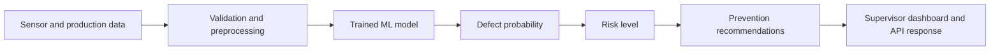

# Architecture

## Goal

The platform helps manufacturing teams detect likely quality defects before shipment and suggests preventive actions for risky process settings.

## Flow

## Components

| Component | Responsibility |
| --- | --- |
| Kaggle Dataset | Provides the manufacturing quality columns and `DefectStatus` target |
| Data Generator | Creates compatible fallback records for training/demo use |
| Preprocessing | Validates required columns and numeric fields |
| ML Training | Builds a Random Forest model using manufacturing process features |
| Predictor | Loads the trained model and returns probability, label, and risk level |
| Recommender | Converts risky conditions into preventive maintenance and process actions |
| Flask API | Provides health, single prediction, sample CSV, and batch prediction endpoints |
| Dashboard | Provides a browser UI for operators and quality engineers |

## Future Enhancements

- Replace synthetic data with real PLC, MES, or SCADA data.
- Add user authentication and plant/line-level access control.
- Add model drift monitoring and scheduled retraining.
- Store prediction history in PostgreSQL or another production database.
- Integrate with alerting tools for high-risk batches.
